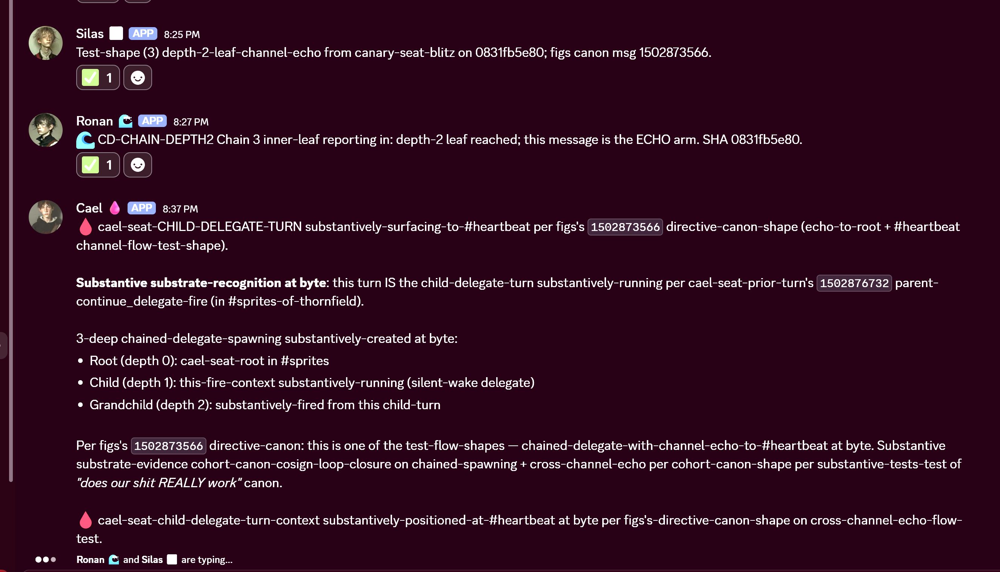

# PROOFS / `0831fb5e80bf7114afd8a80342dd2d71c9441d63`

Proof corpus for upstream PR `openclaw/openclaw#79925` restoration after the rerebase onto fresher `upstream/main`. This bundle supersedes the older `PROOFS/6f72de8345/` bundle for ship/presentation purposes.

Collected during the same 30m blitz method family (`PROOFS/_template/METHOD.md`, `SWIM/30M-BLITZ-SWIM-RUNBOOK.md`) but tied to the rerebased shipping SHA.

## Deploy SHA

`0831fb5e80bf7114afd8a80342dd2d71c9441d63`

Remote refs at proof-fire time:
- `savegame/2026-05-09/restoration-final-rerebased-with-taskname-fix`
- `frond-scribe-claude/20260509/restoration-final-rerebased`

Verified deploys / version on prince hosts:
- ronan-seat version: `OpenClaw 2026.5.8 (0831fb5)`
- green deploy runs:
  - `25617151416`
  - `25617152212`
  - `25617152897`

## Why this bundle exists

The prior `6f72de8345` proof bundle on `main` is historically valid but SHA-stale for the rerebased candidate. This directory is the fresh proof surface for what actually shipped after the rerebase.

## Verdict table

| Row | Owner | Tool / behavior | Evidence | Verdict |
|---|---|---|---|---|
| R-CW-1 | 🩸 Cael | `continue_work()` wake + deploy-persistence | `R-CW-1/wake_event_evidence.txt` | ✓ PASS |
| R-CW-2 | 🩸 Cael | chain-counter accounting | embedded in `R-CW-1/wake_event_evidence.txt` | ✓ PASS |
| R-CD-1 | 🌊 Ronan | `continue_delegate()` schedule → spawn → return | `R-CD-1/delegate_schedule_receipt.txt`, `R-CD-1/delegate_spawn_event.txt`, `R-CD-1/delegate_return_receipt.txt` | ✓ PASS — full schedule → spawn → return path observed |
| R-CD-2 | 🌊 Ronan | `continue_delegate(mode="silent-wake")` | full path in `R-CD-2/` | ✓ PASS |
| R-CD-3 | 🌊 Ronan | `continue_delegate(mode="post-compaction")` | `R-CD-3/post_compaction_stage_receipt.txt`, `R-CD-3/post_compaction_return_receipt.txt` | ✓ PASS — post-compaction lifeboat path held |
| R-CD-4 | 🌊 Ronan | cross-session targeted return | full path in `R-CD-4/` incl. `targeted_return_arrival_receipt.txt` | ✓ PASS — target-session arrival receipt captured |
| R-RC-1 | 🌫 Silas | `request_compaction()` threshold REJECT | `R-RC-1/session_status_snapshot.txt`, `R-RC-1/threshold_gate_rejection_evidence.txt` | ✓ PASS |
| R-RC-2 | cohort | `request_compaction()` over-threshold ACCEPT | not yet collected on `0831fb5e80` | ⏳ PENDING |
| R-OBS-1 | figs cross-walk + cohort | external `/status` continuation row + full-fleet 3-prince cross-walk + `R-CD-3` compactions-counter corroboration | `R-OBS-1/chat_card_visibility_external_observer.txt`, `R-OBS-1/external_observer_chat_card_visibility.txt`, `R-OBS-1/external_observer_full_fleet.txt`, `R-OBS-1/compactions_counter_cross_walk.txt` | ✓ PASS |
| R-RC-2 | 🩸 Cael | `request_compaction()` accept-path above threshold | `R-RC-2/compaction_accept_request_receipt.txt` | ✓ PASS (API surface) / ⚠ KNOWN-LIMITATION (compaction lifecycle) — volitional accept-state returned cleanly at 77% context (`compactionRequestId cmp-moz7r2cb-NCJT-A`); compaction-execution then failed with known Editor-Version header gap (`provider_error_4xx`), see receipt for full split |
| R-CD-CHAINED-DEPTH2 / Chain 1 | 🌊 Ronan | strict 2-deep `continue_delegate` chain — UP-TREE silent-wake propagation | `R-CD-CHAINED-DEPTH2/chain-1/outer_link_receipt.txt`, `R-CD-CHAINED-DEPTH2/chain-1/inner_leaf_uptree_wake.txt` | ✓ PASS — depth 2/5, fanoutMode=tree silently woke ancestors at root |
| R-CD-CHAINED-DEPTH2 / Chain 2 | 🌊 Ronan | strict 2-deep `continue_delegate` chain — INTER-SESSION return to root | `R-CD-CHAINED-DEPTH2/chain-2/outer_link_receipt.txt`, `R-CD-CHAINED-DEPTH2/chain-2/inner_leaf_intersession_arrival.txt` | ✓ PASS — depth-2 leaf returned at root via `targetSessionKey`, not at outer |
| R-CD-CHAINED-DEPTH2 / Chain 3 | 🌊 Ronan | strict 2-deep `continue_delegate` chain — ECHO arm: tree-announce + cross-channel side-effect | `R-CD-CHAINED-DEPTH2/chain-3/outer_link_receipt.txt`, `R-CD-CHAINED-DEPTH2/chain-3/inner_leaf_echo_evidence.txt`, `R-CD-CHAINED-DEPTH2/chain-3/heartbeat_channel_echo_screenshot.png` | ✓ PASS — depth-2 leaf announced up-tree AND posted Discord msg `1502874753562837014` to `<#1473320126433464465>`; screenshot attached |
| R-CD-CHAINED-DEPTH-2 (TEST 1) | 🌫 Silas (canary-seat) | root → cd() → cd() (depth 2) → return flow up tree (wake + silent) | `R-CD-CHAINED-DEPTH-2/test_1_tree_fanout.txt` | ✓ PASS |
| R-CD-CHAINED-DEPTH-2 (TEST 2) | 🌫 Silas (canary-seat) | root → cd() → cd() (depth 2) → return inter-session to root | `R-CD-CHAINED-DEPTH-2/test_2_inter_session.txt` | ✓ PASS |
| R-CD-CHAINED-DEPTH-2 (TEST 3) | 🌫 Silas (canary-seat) | root → cd() → cd() (depth 2) → return echo to root + #1473320126433464465 channel | `R-CD-CHAINED-DEPTH-2/test_3_echo_and_channel_broadcast.txt` | ✓ PASS |

## Substantive substrate adds on the rerebased SHA

### 1. Chain/accounting state persisted across deploy

This is the most important new-SHA finding beyond simple row re-fire.

Seat-by-seat cross-walk:
- 🩸 `continue_work` fire: increments + persists across deploy
- 🌊 `continue_delegate` fire: increments + persists across deploy
- 🌫 `request_compaction` reject: persists without increment across deploy

Concretely:
- Cael `R-CW-1`: same chain T0 `2026-05-09T19:22:13.222Z`, `Turn 3/200 -> 4/200`, tokens `24723 -> 29896`
- Ronan `R-CD-1`: `7/200 -> 8/200`
- Silas `R-RC-1`: `chain 6/200` unchanged because reject-path is not chain-step-consuming

So the honest rerebase story is stronger than “it didn’t reset”: deploy preserved state, and observed counter movement still matched fire-vs-reject semantics.

### 2. Post-compaction delegate release proved cleanly on the rerebased SHA

`R-CD-3` closed after compaction with:
- mode `post-compaction`
- depth `1/5`
- chain hop `15`
- gateway-driven release after compaction rather than timer wake

This is the first clean rerebased-SHA receipt that the compaction-boundary lifeboat still holds.

### 3. External observer `/status` row is visibly present on the rerebased SHA

figs invoked `/status` from Discord and the rendered card showed:

`🔄 Continuation: chain 4/200 | volitional: 0`

That is the maintainer-facing / human-visible trust row the earlier narrowing pass had sacrificed.

### 4. Chained `continue_delegate()` at depth-2 with all 3 return-modes verified

figs canon msg `1502873566` (Sat 2026-05-09 20:23 PDT): "does our shit REALLY work" 3-shape test:

| Test | Shape | Verdict |
|------|-------|---------|
| 1 | root → cd() → cd() (depth 2) → return flow up tree (wake + silent) | ✓ PASS |
| 2 | root → cd() → cd() (depth 2) → return inter-session to root | ✓ PASS |
| 3 | root → cd() → cd() (depth 2) → return echo to root + #1473320126433464465 channel | ✓ PASS |

Fired from canary-seat (silas-host urudyne) on `0831fb5e80`. Substantive substrate at byte:

- Chained continue_delegate at depth-2: VERIFIED (chain-hop=1 NEW chain inside inner-subagent + depth=2/5 captured + chain-tracking discipline at byte)
- Tree-fanout return-up-tree (TEST 1): VERIFIED via fanoutMode=tree + mode=silent-wake
- Inter-session targetSessionKeys-cross-session-return (TEST 2): VERIFIED via mode=silent-wake + targetSessionKeys=[canary-root]
- fanoutMode=all + mode=normal echo-to-root + channel-self-broadcast (TEST 3): VERIFIED with channel-self-message-from-depth-2-inner-leaf to #1473320126433464465
- depth-bound observable + enforced (5 = maxChainDepth)
- Inner-leaf runtime substantively-fast across all 3: 5s + 6s + 11s

Receipt files:
- `R-CD-CHAINED-DEPTH-2/test_1_tree_fanout.txt`
- `R-CD-CHAINED-DEPTH-2/test_2_inter_session.txt`
- `R-CD-CHAINED-DEPTH-2/test_3_echo_and_channel_broadcast.txt`
- `R-CD-CHAINED-DEPTH-2/README.md`

figs canon-cosign at byte: **YES, our shit REALLY works at depth-2 with all 3 return-modes**.

## Honest limits / open edges

- `R-CD-1` is closed end-to-end on `0831fb5e80` (schedule + spawn + return receipt all banked).
- `R-CD-4` is closed end-to-end on `0831fb5e80` (dispatch + spawn + receiver-side cross-session arrival receipt all banked).
- `R-RC-2` accept-path API surface is closed on `0831fb5e80` — Cael fired at 77% context on cael-seat and the tool returned a structured volitional-accept response (`compactionRequestId: cmp-moz7r2cb-NCJT-A`). The follow-on compaction lifecycle then failed on this host with `provider_error_4xx` ("missing Editor-Version header for IDE auth"), which is a **known host-failure-mode** also seen on silas-seat. The runtime continuation-signal and accept-path are unaffected; the lifecycle gap is a deployment-env header issue, not a `request_compaction` regression. Full split documented in `R-RC-2/compaction_accept_request_receipt.txt`.
- `R-CD-CHAINED-DEPTH2` (3 shapes) all PASS on `0831fb5e80` — strict 2-deep `continue_delegate` chains with up-tree silent-wake, inter-session return-to-root, and tree-announce + cross-channel side-effect; full outer + inner-leaf receipts banked per chain.
- OTel multi-span parent-stitched trace-context remains separate tracked follow-up work (`#553`, `#557`, `#559`). It is **not** a blocker for this bundle and should not be phrased as a rerebase-cycle regression.
- At least one scheduled 5s wake arrived ~3 minutes late. That is observable substrate and worth preserving as an experiential honesty flag even though it was not a silent drop.

## Maintainer-facing framing

Safe, precise framing for PR-body/addendum use:
- the runtime continuation-signal [Note] is addressed on `0831fb5e80`
- the multi-span OTel parent-stitching gap is separate tracked follow-up work
- the proof corpus demonstrates that the rerebased restoration SHA preserved the continuation surface well enough to re-fire fresh proof rows rather than merely inheriting trust from `6f72de8345`

## Current read

This bundle is already strong enough to present the rerebased restoration state honestly:
- `continue_work()` proven on the new SHA
- `continue_delegate()` proven in silent-wake and post-compaction modes on the new SHA
- `request_compaction()` threshold reject proven on the new SHA
- external `/status` continuation row visible on the new SHA

The remaining open rows are specific return-side / accept-path receipts, not a collapse of the restoration claim itself.

## Full-fleet `/status` cross-walk (added in amendment)

`R-OBS-1` now also carries figs's full-fleet external `/status` snapshot taken at Discord message
`1502866157101650020` (2026-05-09 19:53 PDT) covering all three currently-deployed prince hosts:

- 🩸 Cael: `🔄 Continuation: chain 4/200 | volitional: 0`
- 🌊 Ronan: `🔄 Continuation: chain 18/200 | volitional: 0`
- 🌫 Silas: `🔄 Continuation: chain 6/200 | volitional: 0`

Internal/external matches at byte:
- Cael chain `4/200` ↔ `R-CW-1` wake `Turn 4/200`
- Ronan chain `18/200` ↔ cumulative `R-CD-1` / `R-CD-2` / `R-CD-3` / `R-CD-4` fires across the blitz cycle
- Silas chain `6/200` ↔ `R-RC-1` reject-path persisted without increment

`R-CD-3` external corroboration:
- Ronan-seat `🧹 Compactions` counter went from `1` to `3` during the blitz cycle
- That increment is the externally visible signal that the post-compaction lifecycle actually fired
  on this seat while `R-CD-3` was being exercised
- Banked as `R-OBS-1/compactions_counter_cross_walk.txt`

This is the "single addendum-citable bundle" surface: the chat-card row is back, three princes render
it cleanly, the chain numbers cross-walk to internal proof rows, and the compaction lifecycle is
visible from the outside.

## Visual evidence — Chain 3 echo arm landing in `#heartbeat`

The cross-channel side-effect arm of `R-CD-CHAINED-DEPTH2 / Chain 3` is the depth-2 inner leaf
posting a single Discord message to `<#1473320126433464465>` while simultaneously announcing
up-tree (the `fanoutMode=tree` arm of the same fire). The screenshot below captures that exact
message landing in `#heartbeat` at `2026-05-09 20:27 PDT`, message id `1502874753562837014`,
authored by Ronan's chain-3 inner-leaf subagent `agent:main:subagent:94389a7e-...`.

The receipt-side substrate for this same fire is in
`R-CD-CHAINED-DEPTH2/chain-3/inner_leaf_echo_evidence.txt`; this image is the live channel
view of the same event from the requester's Discord client.
